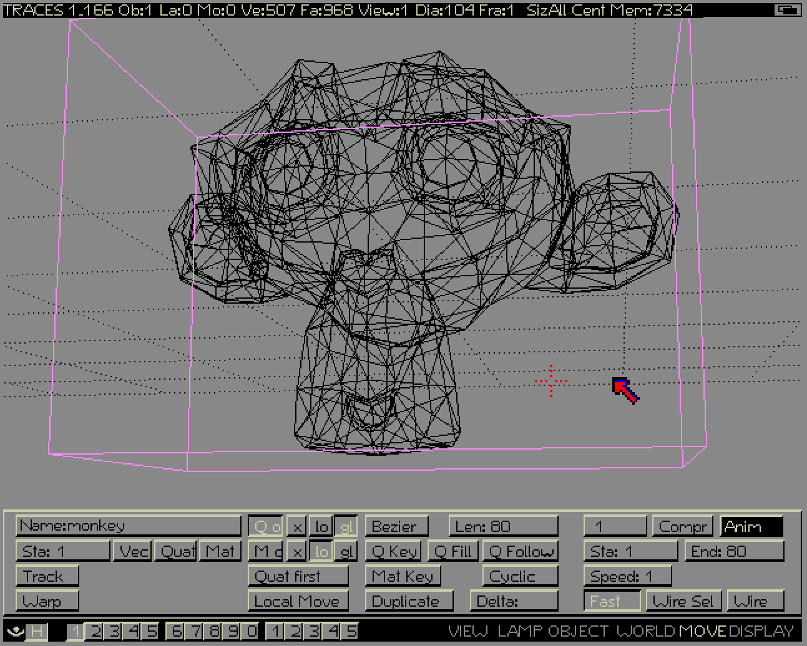

# Traces (Amiga version)

## Introduction
 This is a repository for my Amiga Traces restoration project.
 
Traces is an in-house 3D modeling, animation, and ray tracing software developed by the Dutch animation studio NeoGeo Videographics. This software later got rewritten into what we know today as Blender.

## Installation
To run the software, you need either a working Amiga computer or an emulator. From my experience, the software works best with Workbench 1.3. But it will work on versions 2.x and 3.x as well. Before running the software, make sure to install the required dependencies. There are 3 files that the software needed to run correctly. First, iff.library needs to be put into the Libs folder in the amiga directory. There's also univers.font and univers folder that needs to be put into the Fonts folder in the amiga directory. After that, you could run Traces by using Traces disk 1. or by Putting the Traces folder with the info file into the amiga directory.

Here are some of the shortcuts used in the software:

>F1 - load scene
>
>F2 - save scene
>
>Numpad digit keys - manipulate view
>
>Space - on-screen menu
>
>Right click - select object
>
>Enter - draw wireframe (default is bounding box view)
>
>G, R, S - Grab, Rotate, Scale
>
>B - border select

There are some test scenes provided, including one that looks like a commercial for Philips. Also, Traces accepts Sculpt 3D object format.

For more tutorial, I suggest watching my [Traces Installation Tutorial](https://www.youtube.com/watch?v=VytkRK0bQHE) and Blender Bach [Traces Tutorial](https://www.youtube.com/watch?v=zKn8qjgG1YA&t=0s)

All information used in this project is based on Piotr Zgodziński's article on [Blender’s prehistory](https://zgodzinski.com/blender-prehistory/).
